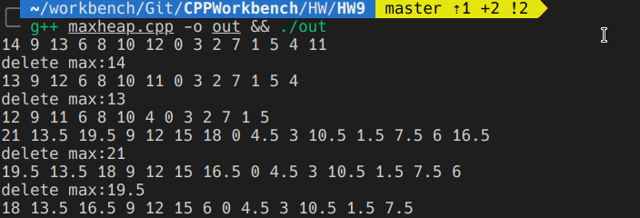
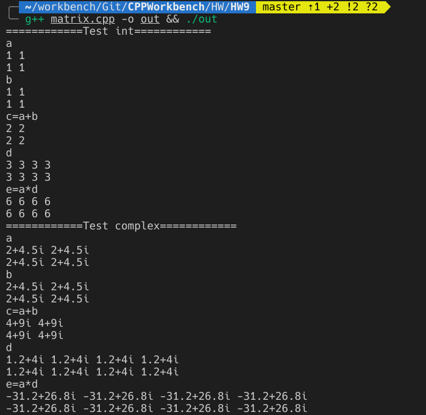

# HW9

*181220076 周韧哲*

### 一. 概念题

1. + 错误，函数模板必须由编译器根据程序员的调用类型实例化为可执行的函数。
   + 正确。
   + 错误，类模板的成员函数都是函数模板。
   + 错误，没使用过的成员函数（即函数模板）不会被实例化。
2. 类模板实例化的每个模板类都有自己的类模板静态数据成员，不同类模板实例之间不共享类模板中的静态成员。
3. 由于源文件是分别编译的，如果在一个源文件中定义和实现了一个模板，但该源文件没有使用到该模板的某个实例，则编译器不会生成相应实例的代码，另外一个源文件如果用到了这个实例就会导致连接错误。定义和实现放在头文件，在需要使用模板的源文件中包含这个头文件就可以避免这个问题。

### 二. 编程题

1. ```c++
   template<class Type>
   class MaxHeap {
   private:
       Type* Data;
       int Size; //当前大小
       int Capacity; //总容量
       void shiftup(int start){
           int curr = start;
           int parent = (curr-1)/2;
           while(curr>0){
               if(Data[parent] < Data[curr]){
                   Type tmp = Data[curr];
                   Data[curr] = Data[parent];
                   Data[parent] = tmp;
                   curr = parent;
                   parent = (parent-1)/2;
               }else{
                   break;
               }
           }
   
       }
       void shiftdown(int start){
           int curr = start;
           int child = 2*curr + 1;
           while(child < Size){ 
               if(child < Size-1 && Data[child] < Data[child+1])
                   child++;
               if(Data[curr] < Data[child]){
                   Type tmp = Data[curr];
                   Data[curr] = Data[child];
                   Data[child] = tmp;
                   curr = child;
                   child = 2*child+1;
               }else{
                   break;
               }
           }
       }
   public:
       MaxHeap(){
           Size = 0;
           Capacity = 10;
           Data = new Type[Capacity];
       }
       MaxHeap(int Capacity){
           Size = 0;
           this->Capacity = Capacity;
           Data = new Type[Capacity];
       }
       ~MaxHeap(){
           delete []Data;
       }
       bool Insert(Type element){
           if(IsFull())
               return false;
           Data[Size] = element;
           shiftup(Size);
           Size++;
           return true;
       }
       Type DeleteMax(){
           Type _max = Data[0];
           Size--;
           Data[0] = Data[Size];
           shiftdown(0);
           return _max;
       }
       bool IsFull(){
           return Size == Capacity;
       }
       bool IsEmpty(){
           return Size == 0;
       }
       void Print(){
           for(int i=0;i<Size;i++){
               cout<<Data[i]<<" ";
           }
           cout<<endl;
       }
   };
   ```

   测试用例如下：

   ```c++
   int main(){
       MaxHeap<int> heap(20);
       for(int i=0;i<15;i++){
           heap.Insert(i);
       }
       heap.Print();
       cout<<"delete max:"<<heap.DeleteMax()<<endl;
       heap.Print();
       cout<<"delete max:"<<heap.DeleteMax()<<endl;
       heap.Print();
       MaxHeap<double> _heap(20);
       for(int i=0;i<15;i++){
           _heap.Insert(i*1.5);
       }
       _heap.Print();
       cout<<"delete max:"<<_heap.DeleteMax()<<endl;
       _heap.Print();
       cout<<"delete max:"<<_heap.DeleteMax()<<endl;
       _heap.Print();
       return 0;
   }
   ```

   输出如下，可以看出程序实现正确：

   

2. ```c++
   template<class Type>
   class Matrix;
   
   template<class Type>
   class Array{
       Type *data;
       int length;
   public:
       Array(){
           length = 0;
       }
       Array(int c){
           set(c);
       }
       ~Array(){
           delete []data;
       }
       void set(int c){
           length = c;
           data = new Type[c];
       }
       Type &operator[] (int j){
           return data[j];
       }
       friend class Matrix<Type>;
   };
   
   template<class Type>
   class Matrix{
       Array<Type> *p_data;
       int row, col; 
       void init(int r, int c){
           row = r;
           col = c;
           p_data = new Array<Type>[r];
           for(int i=0;i<row;i++){
               p_data[i].set(c);
           }
       }
   public:
       Matrix(){
           row = col = 0;
           p_data = NULL;
       }
       Matrix(int r, int c){
           init(r, c); 
       }
       ~Matrix(){
           delete []p_data;
       }
       Array<Type> &operator[] (int i){ 
           return p_data[i];
       }
       Matrix<Type> &operator= (const Matrix &m){ 
           if(&m == this) return *this;
           if(row != m.row || col != m.col){
               delete []p_data;
               init(m.row, m.col); 
           }
           for(int i=0;i<row;i++){
               for(int j=0;j<col;j++){
                   Type tmp = m.p_data[i].data[j] ;
                   p_data[i].data[j] = tmp;
               }
           }
           return *this;
       }
       bool operator== (const Matrix &m) const{
           if(row != m.row || col != m.col)
               return false;
           for(int i=0;i<row;i++){
               for(int j=0;j<col;j++){
                   if(p_data[i][j]!=m.p_data[i][j])
                       return false;
               }
           }
           return true;
       }
       Matrix<Type> operator+ (const Matrix &m) const{ 
           Matrix tmp(row, col);
           for(int i=0;i<row;i++){
               for(int j=0;j<col;j++){
                   tmp[i][j] = p_data[i][j] + m.p_data[i][j];
               }
           }
           return tmp;
       }
       Matrix<Type> operator* (const Matrix &m) const{
           Matrix tmp(this->row, m.col);
           for(int i=0;i<tmp.row;i++){
               for(int j=0;j<tmp.col;j++){
                   Type sum;
                   for(int p=0;p<col;p++){
                       if(p==0)
                           sum = p_data[i][p] * m.p_data[p][j];
                       else
                           sum = sum + p_data[i][p] * m.p_data[p][j];
                   }
                   tmp[i][j] = sum;
               }
           }
           return tmp;
       }
       void print(){
           for(int i=0;i<row;i++){
               for(int j=0;j<col;j++){
                   cout<<p_data[i].data[j]<<" ";
               }
               cout<<endl;
           }
       }
       void set(Type p){
           for(int i=0;i<row;i++){
               for(int j=0;j<col;j++){
                   p_data[i].data[j] = p;
               }
           }
       }
   };
   
   class Complex{
       double real, imag;
   public:
       Complex(){
           real = 0;
           imag = 0;
       }
       Complex(double r, double i){
           real = r;
           imag = i;
       }
       bool operator ==(const Complex& x) const{
           return (real == x.real) && (imag == x.imag);
       }
       bool operator !=(const Complex& x) const{
           return (real != x.real) || (imag != x.imag);
       }
       Complex operator +(const Complex& x){
           return Complex(real + x.real, imag + x.imag);
       }
       Complex operator *(const Complex& x){
           return Complex(real * x.real- imag * x.imag, real * x.imag + imag * x.real);
       } 
       friend ostream &operator<<(ostream &out, const Complex &c){
           out<<c.real<<"+"<<c.imag<<"i";
           return out;
       }
   };
   ```

   测试用例如下：

   ```c++
   int main(){
       cout<<"============Test int============"<<endl;
       do{
           Matrix<int> a(2,2);
           a.set(1);
           Matrix<int> b;
           b = a; 
           Matrix<int> c = a+b;
           Matrix<int> d(2,4);
           d.set(3);
           Matrix<int> e = a*d;
           cout<<"a"<<endl;
           a.print();
           cout<<"b"<<endl;
           b.print();
           cout<<"c=a+b"<<endl;
           c.print();
           cout<<"d"<<endl;
           d.print();
           cout<<"e=a*d"<<endl;
           e.print();
       }while(0);
       cout<<"============Test complex============"<<endl;
       Complex c1(2, 4.5);
       Complex c2(1.2, 4);
       Complex c3(2, 2.3);
       Complex c4 = c1*c3;
       Matrix<Complex> a(2,2);
       a.set(c1);
       Matrix<Complex> b;
       b = a; 
       Matrix<Complex> c = a+b;
       cout<<"a"<<endl;
       a.print();
       cout<<"b"<<endl;
       b.print();
       cout<<"c=a+b"<<endl;
       c.print();
       Matrix<Complex> d(2,4);
       d.set(c2);
       Matrix<Complex> e = a*d;
       cout<<"d"<<endl;
       d.print();
       cout<<"e=a*d"<<endl;
       e.print();
       return 0;
   }
   ```

   输出如下，可以看出程序实现正确：

   

   

   