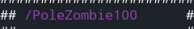
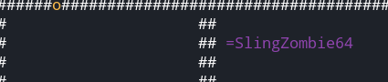
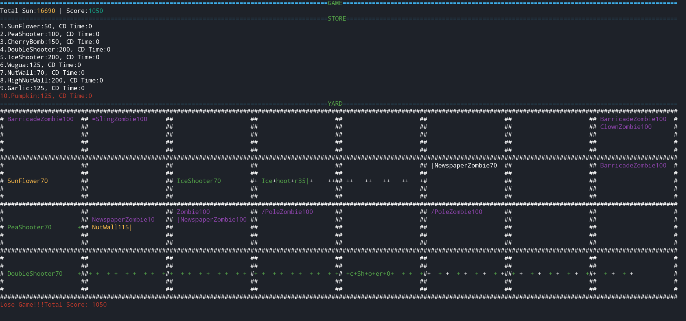

# 第二次课程设计报告

*181220076 周韧哲* 

## 运行方式

本项目选题为植物大战僵尸，基于linux系统开发，请确保安装make, g++ , curses。命令行输入`make run`即可编译运行，或者直接运行可执行文件`./build/Proj-out`。本项目已在ubuntu和manjaro系统经过测试，可以正常运行。如运行遇到问题，请通过QQ联系。

游戏按键操作：

+ 按b进入商店购买模式
+ 上下方向键选择需要购买的植物
+ 按x离开商店，进入庭院
+ 按回车键在庭院中确认购买
+ 上下左右方向键可选择格子来种植购买的植物
+ 按q可退出游戏

为了能够正确显示图像，请确保**终端的长和宽足够大**，可使用`echo $LINES,$COLUMNS`命令查看，需要确保LINES大于等于48，COLUMNS大于等于190。

## 目录树

本项目目录树如下：

```bash
.
├── include/                    #头文件
│   ├── bullet.h
│   ├── common.h
│   ├── courtyard.h
│   ├── game.h
│   ├── input.h
│   ├── plant.h
│   ├── store.h
│   └── zombie.h
├── Makefile
└── src/                        #源文件
    ├── bullet/                 #子弹
    │   └── bullet.cpp
    ├── courtyard/              #庭院
    │   ├── courtyard.cpp
    │   └── grid.cpp
    ├── game.cpp                #控制中枢
    ├── main.cpp                #程序入口
    ├── plant/                  #植物
    │   └── plant.cpp
    ├── store/                  #商店
    │   ├── plantplate.cpp
    │   └── store.cpp 
    └── zombie/                 #僵尸
        └── zombie.cpp
```

## 具体设计

本次项目目标是实现一个基于控制台的植物大战僵尸，在第一次课程设计的基础上增加植物与僵尸种类。在本次实验中，我的工作主要包括：

+ 实现了双发射手，其发射速度是豌豆射手的两倍，还有寒冰射手，造成伤害的同时减速僵尸的移动。
+ 实现了坚果墙与高坚果墙。
+ 实现了窝瓜，当有僵尸出现在地块内之后，炸毁该地块的所有僵尸；实现了樱桃炸弹，炸掉周围3x3地块上的所有僵尸。
+ 实现了大蒜，啃⻝过大蒜的僵尸会被驱赶到邻近行，实现了南瓜头，种在其他植物上，僵尸需要先吃掉南瓜头才能再吃其内的植物。
+ 实现了普通子弹与冷却子弹，冷却子弹能够降低僵尸的速度。实现了篮球，篮球能够被扔出去远程攻击植物。
+ 实现了路障僵尸：有较高的防御力；实现了读报僵尸：报纸被打掉后,移动速度加快；实现了撑杆僵尸：可以跳过遇到的第一个植物；以及小丑僵尸：以一定概率自爆,并炸毁周围3x3地块上的植物；还有投石僵尸：用篮球远程攻击第一个遇到的植物，待篮球投完后会缓慢开⻋碾压植物。
+ 显示了植物以及僵尸的剩余生命值，每个地块中可以有多个僵尸。
+ 实现了随机产生阳光并记录游戏分数。
+ 实现了每隔一定时间僵尸的一大波攻击。
+ 能够在商店用方向键选择植物并购买，买后每种植物有一定的冷却时间。
+ 使用curses来在终端绘图。

我使用一个共同的类LivingObject来作为植物、僵尸、子弹等的基类，因为他们都可以抽象出一些共同的属性：有生命值、攻击值、速度等等，都有坐标，都需要和庭院产生交互，都需要渲染颜色。因而，我使用了枚举类型确定了每一种植物、僵尸以及子弹的类型，并构造结构体InitTable来管理他们的属性的设计数值：

```c++
enum ObjectType{
    sunflower, peashooter, cherrybomb, doubleshooter, iceshooter,  wugua, nutwall, highnutwall, garlic, pumpkin,
    zombie, barricadezombie, newspaperzombie, polezombie, clownzombie, slingzombie, bullet, icebullet, ball
};

struct InitTable{
    char name[32];
    int health;
    int attack_damage;
    int sun_cost;
    int defense;
    int prod_sun;
    int cd_time;
    int speed;
    int act_time;  //隔多久产生动作
    int kill_score;
    int color_pair;
}static init_table[] = {
    {      "SunFlower",  70,    0,  50,  1, 50,  5,  0, 800,  0, YELLOW_BLACK},
    {     "PeaShooter",  70,    0, 100,  1,  0,  5,  0,  50,  0, GREEN_BLACK},
    {     "CherryBomb",  70, 1000, 150,  1,  0, 10,  0, 100,  0, RED_BLACK},
    {  "DoubleShooter",  70,    0, 200,  1,  0,  5,  0,  25,  0, GREEN_BLACK},
    {     "IceShooter",  70,    0, 200,  1,  0,  5,  0,  50,  0, GREEN_BLACK},
    {          "Wugua",  70, 1000, 125,  1,  0,  5,  0, 100,  0, GREEN_BLACK},
    {        "NutWall", 200,    0, 70,   1,  0,  5,  0,   1,  0, YELLOW_BLACK},
    {    "HighNutWall", 400,    0, 200,  1,  0,  5,  0,  50,  0, YELLOW_BLACK},
    {         "Garlic",  70,    0, 125,  1,  0,  5,  0,   1,  0, RED_BLACK},
    {        "Pumpkin", 200,    0, 125,  1,  0,  5,  0,   1,  0, RED_BLACK},
    {         "Zombie", 100,    5,   0,  1,  0,  0,  1, 500, 50, MAGENTA_BLACK},
    {"BarricadeZombie", 100,    5,   0,  2,  0,  0,  1, 500, 50, MAGENTA_BLACK},
    {"NewspaperZombie", 100,    5,   0,  1,  0,  0,  1, 500, 50, MAGENTA_BLACK},
    {     "PoleZombie", 100,    5,   0,  1,  0,  0,  1, 500, 50, MAGENTA_BLACK},
    {    "ClownZombie", 100,    5,   0,  1,  0,  0,  1, 500, 50, MAGENTA_BLACK},
    {    "SlingZombie", 100,    5,   0,  1,  0,  0,  1, 800, 50, MAGENTA_BLACK},
    {         "Bullet",   1,    2,   0,  1,  0,  0,  2,  10,  0, GREEN_BLACK},
    {      "IceBullet",   1,    2,   0,  1,  0,  0,  2,  10,  0, WHITE_BLACK},
    {           "Ball",   1,   30,   0,  1,  0,  0,  2,  10,  0, YELLOW_BLACK},
};

```

在LivingObject中，实现了类内部计数器counter，当counter=0时，当前时刻能够进行动作，如对于向日葵来说是否可以产生阳光，豌豆射手是否可以射子弹，僵尸是否可以攻击或前进（等价于速度）等等。

```c++
void LivingObject::increase_counter(){
    counter = (counter+1)%act_time;
}
```

由于init_table的存在，可以很容易初始化各种东西，且想修改时较好修改，如Pumpkin的构造函数：

```c++
Pumpkin::Pumpkin(){
    this->type = pumpkin;
    this->health = init_table[this->type].health;
    this->act_time = init_table[this->type].act_time;
    this->defense = init_table[this->type].defense;
    this->counter = 0;
}
```

在main函数中会依次调用store.init()、courtyard.init()以及init_curse()来初始化绘图窗口。游戏进行逻辑是：

+ 当curr_time和last_time的差达到阈值后，游戏才开始更新渲染。
+ 渲染图像。
+ 若玩家输了，打印信息并退出。
+ 否则游戏继续，若检测到按键，则处理按键事件，包括移动光标、选择植物、种植植物等等。
+ 游戏更新，处理当前状态，并随机产生阳光与僵尸。

游戏更新时，首先检查状态，检查子弹、僵尸、植物等是否死亡，并更新分数。然后在store中进行更新，其主要是对商品进行冷却，然后courtyard进行更新，会检测僵尸是否在吃植物，是否有子弹打中僵尸，以及僵尸前进，子弹前进，植物产生阳光，植物产生子弹等等一系列逻辑。

这次主要添加了多种植物与僵尸，其中在显示时会将剩余生命值显示在名字后面。其设计逻辑如下：

+ 双发射手：直接另其发射速度为豌豆射手的两倍即可。

+ 寒冰射手：增加一种子弹类型：寒冰子弹，僵尸在碰到寒冰子弹后会降低一段时间内的反应速度。寒冰子弹的颜色为白色，被冷冻的僵尸也变为白色。

+ 窝瓜与樱桃炸弹：设置为种植2秒后爆炸，并使得周围僵尸死亡。

+ 坚果墙与高坚果墙：直接另其的生命值比普通植物高不少即可。

+ 大蒜：只需要僵尸在吃它的时候判断一下，然后调整僵尸的位置即可。

+ 南瓜头：在grid中增加一个指针指向plant mount，当僵尸所在地块有plant mount时，僵尸优先把plant mount吃掉。拥有南瓜头的植物会在名字后面显示一个"|"，如下图所示：

  

+ 路障僵尸：令其有较高的防御力即可。

+ 读报僵尸：拥有报纸，被打掉后，移动速度加倍。报纸显示为一个"|"，如下：

  

+ 撑杆僵尸：拥有撑杆，可以跳过遇到的第一个植物，但不能跳过高坚果墙，撑杆显示为一个"/"，如下：

  

+ 小丑僵尸：会以一定概率自爆，并炸毁周围3 x 3地块上的植物。

+ 投石僵尸：拥有篮球，可以投掷篮球，篮球会打到这一排中遇到的第一个植物。篮球显示为一个"o"，如下，黄色为被投掷出去的篮球，被投掷后，原来前面显示为"o"的投石僵尸如今前面会显示一个"="表示为推车，会碾压路上的植物：

  


## 问题解决

+ 该项目中的每一个类虽然比较简单，但类之间的关系较为复杂，增加了植物与僵尸种类后，需要添加不少属于每个植物或僵尸特有的feature，因此花费了不少时间设计，而且游戏状态更新时的逻辑也大大复杂了起来。


## 功能亮点

+ 使用全局结构体init_table进行初始化数值的存储，直观明了，减少了调试时间。
+ 从植物、僵尸与子弹中大量共同的属性抽象出一个基类，减少了代码量。
+ 使用继承、友元等OOP方法设计项目。
+ 使用curses进行终端绘图，多彩显示。
+ 实现了多种类的植物与僵尸，使游戏性大大增强。

游戏整体效果如下图所示：



感谢助教的阅读！